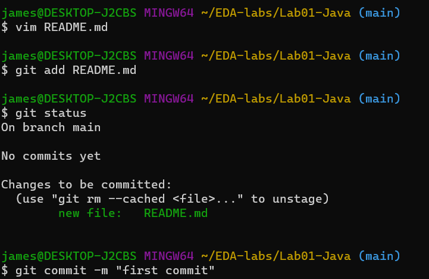
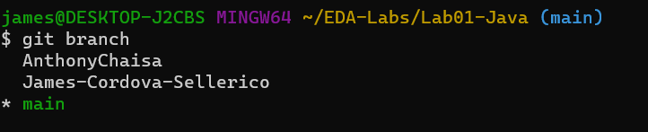
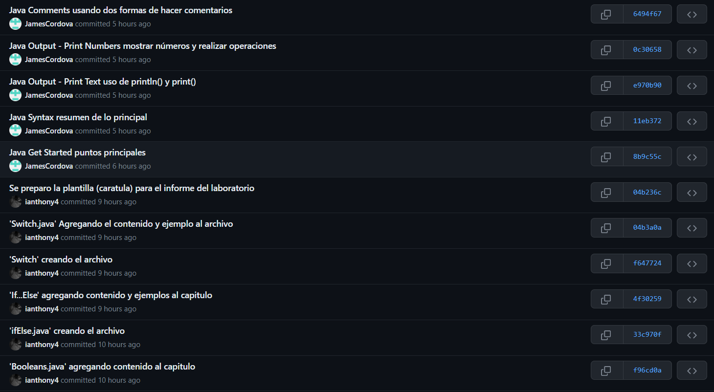
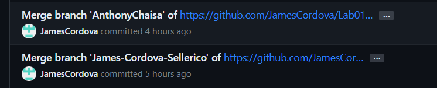

<table>
    <theader>
        <tr>
            <td></td>
            <th>
                UNIVERSIDAD NACIONAL DE SAN AGUSTIN 
                FACULTAD DE INGENIERÍA DE PRODUCCIÓN Y SERVICIOS 
                ESCUELA PROFESIONAL DE INGENIERÍA DE SISTEMAS
            </th>
            <td></td>
        </tr>
    </theader>
    <tbody>
        <tr><td colspan="3">Formato: Guía de Práctica de Laboratorio / Talleres / Centros de Simulación</td></tr>
        <tr><td>Aprobación:  2022/03/01</td><td>Código: GUIA-PRLD-001</td><td>Página: 1</td></tr>
    </tbody>
</table>

INFORME DE LABORATORIO 
(Formato Estudiante)

<table>
<theader>
<tr><th colspan="6">INFORMACIÓN BÁSICA</th></tr>
</theader>
<tbody>
<tr><td>ASIGNATURA:</td><td colspan="5">Estructura de Datos y Algoritmos</td></tr>
<tr><td>TÍTULO DE LA PRÁCTICA:</td><td colspan="5">Git - GitHub</td></tr>
<tr>
<td>NÚMERO DE PRÁCTICA:</td><td>01</td><td>AÑO LECTIVO:</td><td>2023 A</td><td>NRO. SEMESTRE:</td><td>III</td>
</tr>
<tr>
<td>FECHA DE PRESENTACIÓN:</td><td colspan="2">07-05-2023</td><td>HORA DE PRESENTACIÓN:</td><td colspan="2">por definir</td>
</tr>
<tr><td colspan="4">INTEGRANTE (s):
<ul>
<li>Chaisa Fernandez, Anthony Leonel</li>
<li>Cordova Sellerico, James Seus</li>
</ul>
</td>
<td>NOTA:</td><td>Pendiente</td>
</tr>
<tr><td colspan="6">DOCENTES:
<ul>
<li>Edith Giovanna Cano Mamani (ecanoma@unsa.edu.pe)</li>
<li>Karim Guevara Puente de la Vega (kguevarap@unsa.edu.pe)</li>
<li>Richart Smith Escobedo Quispe (rescobedoq@unsa.edu.pe)</li>
</ul>
</td>
</tr>
</tbody>
</table>
<table>
<theader>
<tr><th>SOLUCIÓN Y RESULTADOS</th></tr>
</theader>
<tbody>
<tr><td>I. SOLUCIÓN DE EJERCICIOS/PROBLEMAS 
A. Repositorios del trabajo individual (Laboratorio 01)
<ul>
<li>https://github.com/ianthony4/23ALAB00.git</li>
<li>https://github.com/JamesCordova/Lab00-proyecto.git</li>
</ul>
B. Solucion del Trabajo Grupal: 
 Pasos a detalle... (agregar capturas del codigo si es necesario en una carpeta 'imgLab')
 1. Para empezar, un integrante creó el repositorio GitHub donde los integrates trabajarían en sus respectivas ramas.
 2. Luego se creó el `README.md` con el título del repositorio, entonces los demás integrantes crearon sus ramas para poder trabajar las partes asignadas
 
 3. Cada integrante utilizo sus nombres para crear sus ramas y realizar sus avances.
 
 4. Cada cierto tiempo los integrantes hacían push de lo avanzado.
 
 5. Llegado cierto punto se hacía merge con las ramas ya terminadas a la rama `main`.
 
</td></tr>
<tr><td>II. SOLUCIÓN DEL CUESTIONARIO 
A. ¿Por qué Git y GitHub es una herramienta importante en el curso?  
A lo largo de esta practica, los integrantes hemos podido apreciar que Git y GitHub permite controlar las versiones del proyecto, la colaboracion del proyecto con otras personas, estamos seguros que esa es una forma eficiente de mantener el codigo, tambien se observo que es facil saber lo que un colaborador hace o realiza en el proyecto con la ayuda de los commit's. Todo esto mejora la calidad y eficiencia de un trabajo, proyecto y software.  
B.¿Qué conductas éticas deberían promocionarse cuando se usa un Sistema de Control de Versiones?  
Para que cualquier equipo funcione como tal, se deben cumplir ciertos valores que promueven el desarrollo de todos los integrantes, estos son algunos valores importantes que se debe cumplir en este equipo:   
<ul>
<li>Respeto</li>
<li>Responsabilidad</li>
<li>Compromiso</li>
<li>Honestidad</li>
<li>Comunicacion</li>
</ul> 
C. ¿Qué son los entándares de codificación?  
Son aquellas reglas, prácticas y directrices que se 'recomiendan' para obtener un proyecto consistente y de muy buena calidad para que este sea entendible, mantenible y compartible. 
Estos son algunos de los estandares de codificacion comunes que mejoran el codigo:  
<ul>
<li>Identación</li>
<li>Uso eficiente de espacios</li>
<li>Limite de codigo en una linea</li>
<li>Commit's de buena calidad</li>
<li>Declaracion de variables y/o funciones de valor</li>
<li>Manejo adecuado de errores y excepciones</li>
<li>Seguridad del codigo</li>
</ul> </td></tr>
<tr><td>III. CONCLUSIONES
<ul>
<li>
Git es una herramienta bastante útil para el aprendizaje, ya que permite el fácil intercambio de información entre programadores de todo el mundo.
</li>
<li>
Para lograr un trabajo eficiente como equipo debemos cumplir con ciertos valores necesarios para que el proyecto sea el optimo y deseado, por otro lado se debe seguir otros aspectos que estan vinculadas con las buenas practicas de programación pero que buscan el mismo objetivo de mantener un codigo eficiente, legible y de alta calidad.
</li>
<li>
El trabajo en equipo en Git es óptimo. Si bien puede ser algo complejo al principio, cuando se llega a entender las conexiones, el funcionamiento entre las ramas, el trabajo grupal se convierte en algo sencillo, agradable y funcional.
</li>
</ul>
</td></tr>
</tbody>
</table>
<table>
<theader>
<!---La RETROALIMENTACION lo completa el docente de ser necesario-->
<tr><th>RETROALIMENTACIÓN GENERAL</th></tr>
</theader>
<tbody>
<tr><td>I. RETROALIMENTACIÓN:</td></tr>
<tbody>
</table>
<table>
<theader>
<tr><th>REFERENCIAS Y BIBLIOGRAFÍA</th></tr>
</theader>
<tbody>
<tr><td>I. BIBLIOGRAFÍA
<ul>
<li>https://guides.github.com/</li>
<li>https://www.w3schools.com/java/default.asp</li>
<li>https://learn.microsoft.com/es-es/connectors/custom-connectors/coding-standards</li>
</ul>
</td></tr>
</tbody>
</table>
